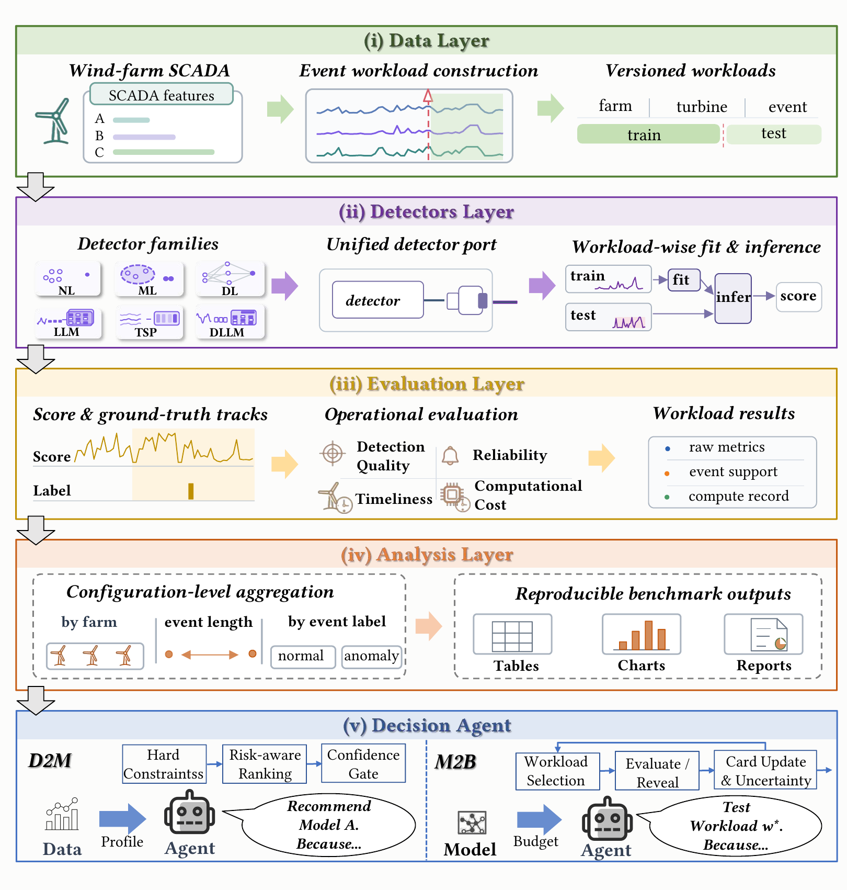

<h1 align="center">WindADBench</h1>

<p align="center">
  <strong>Benchmarking Accuracy, Earliness, Reliability, and Cost across Heterogeneous Wind-Farm SCADA</strong>
</p>

<p align="center">
  <a href="#overview">Overview</a> ·
  <a href="#data">Data</a> ·
  <a href="#quick-start">Quick Start</a> ·
  <a href="#running-the-benchmark">Experiments</a> ·
  <a href="#repository-structure">Structure</a>
</p>

<p align="center">
  
</p>

## Overview

WindADBench is the research codebase for evaluating wind-turbine SCADA anomaly
detectors as **alarm systems**, rather than point classifiers alone. It compares
36 detectors from six model families across four leakage-controlled evaluation
tracks and jointly measures detection quality, warning earliness, false-alarm
reliability, and computational cost.

### Highlights

- **Heterogeneous industrial data:** three wind farms with different turbine
  fleets, sensor schemas, operating conditions, and fault distributions.
- **Four evaluation tracks:** in-farm detection, normal-operation reliability,
  held-out-turbine transfer, and directed cross-farm transfer.
- **Broad model coverage:** non-learning, machine-learning, deep-learning,
  language-model-based, time-series-pretrained, and domain-adapted methods.
- **Operational evaluation:** 25 metrics spanning point-, event-, range-, and
  affiliation-level detection, early warning, false alarms, runtime, and memory.

### Benchmark at a Glance

| | Farm A | Farm B | Farm C | Total |
|---|---:|---:|---:|---:|
| Setting | Onshore | Offshore | Offshore | — |
| Turbines | 5 | 9 | 22 | 36 |
| Sensors | 54 | 63 | 238 | — |
| Features | 86 | 257 | 957 | — |
| Anomalous sequences | 11 | 6 | 27 | 44 |
| Normal sequences | 11 | 9 | 31 | 51 |
| All sequences | 22 | 15 | 58 | 95 |

All SCADA measurements are sampled at 10-minute intervals. Together, the 95
event-centered sequences cover approximately 89 turbine-years.

### Evaluation Tracks

| Track | Setting | Evaluation target |
|---|---|---|
| **Track 1** | In-farm | Disjoint training and evaluation periods from the same turbine |
| **Track 2** | Normal operation | False-alarm stability on normal sequences |
| **Track 3** | Cross-turbine | Fixed held-out turbines within each farm |
| **Track 4** | Cross-farm | Six directed transfers among Farms A, B, and C |

Tracks 1–2 use each farm's full sensor schema. Tracks 3–4 use the shared
semantic features `wind_speed`, `active_power`, and `rotor_speed`. Grid-evaluated
methods in Track 1 are summarized over eight predefined operating points;
methods with native decision procedures retain their native outputs. Transfer
labels are derived under a common 1% normal-point false-positive budget using
only the calibration data permitted by the corresponding protocol.

## Data

The three raw wind-farm datasets are **not stored in this Git repository**
because of their size. Place the `Wind Farm A`, `Wind Farm B`, and `Wind Farm C`
directories in the repository root using the following layout:

```text
WindADBench/
├── Wind Farm A/
│   └── Wind Farm A/
│       ├── datasets/*.csv
│       ├── event_info.csv
│       └── feature_description.csv
├── Wind Farm B/
│   └── Wind Farm B/
│       ├── datasets/*.csv
│       ├── event_info.csv
│       └── feature_description.csv
└── Wind Farm C/
    └── Wind Farm C/
        ├── datasets/*.csv
        ├── event_info.csv
        └── feature_description.csv
```

Each event file contains a normal training partition and a prediction
partition. `event_info.csv` records event labels and anomaly boundaries, while
`feature_description.csv` describes the anonymized sensors and their units.
The benchmark builds `WIND_AD_META.csv` from this structure when needed.

## Quick Start

Clone the repository and initialize its submodules:

```bash
git clone https://github.com/ZJU-DAILY/WindADBench.git
cd WindADBench
git submodule update --init --recursive
```

Create the released environment:

```bash
conda env create -f environment.yml
conda activate wind_benchmark
```

Some LLM-based and time-series-pretrained baselines require external model
weights. The weights are not committed to this repository; official sources,
expected paths, and checksums are listed in [models/README.md](models/README.md).

## Running the Benchmark

Baseline scripts are grouped by model family and output type under
`scripts/baselines/`. For example, run LOF with continuous anomaly scores:

```bash
bash scripts/baselines/non_learning/score/lof.sh
```

Run the corresponding native-label evaluation with:

```bash
bash scripts/baselines/non_learning/label/lof.sh
```

Score runs defer the slow VUS metrics by default. Recompute them after the main
runs with:

```bash
bash scripts/recompute_score_vus.sh 8
```

For a cross-turbine or cross-farm experiment, select a source farm explicitly:

```bash
bash experiments/cross_domain/scripts/baselines/non_learning/lof.sh A
```

Replace `A` with `B` or `C` to train the corresponding source-farm model. The
cross-domain pipeline stores resolved configurations, fixed split plans,
calibration records, predictions, resource measurements, and aggregated
results under `experiments/cross_domain/outputs/`.

## Repository Structure

```text
WindADBench/
├── config/                         # Track 1–2 evaluation templates
├── experiments/cross_domain/       # Track 3–4 protocols and launchers
├── models/                         # External model-asset instructions
├── scripts/baselines/              # Per-model score and label runs
└── tsad_benchmark/
    ├── baselines/                  # Model implementations and adapters
    ├── data/                       # Data loading and preprocessing
    ├── evaluation/                 # Metrics and evaluation strategies
    └── report/                     # Aggregation and report generation
```

The released experiment configurations use random seed `2026`. Per-model
hyperparameters are recorded in the launch scripts and in
`experiments/cross_domain/configs/models/`.
